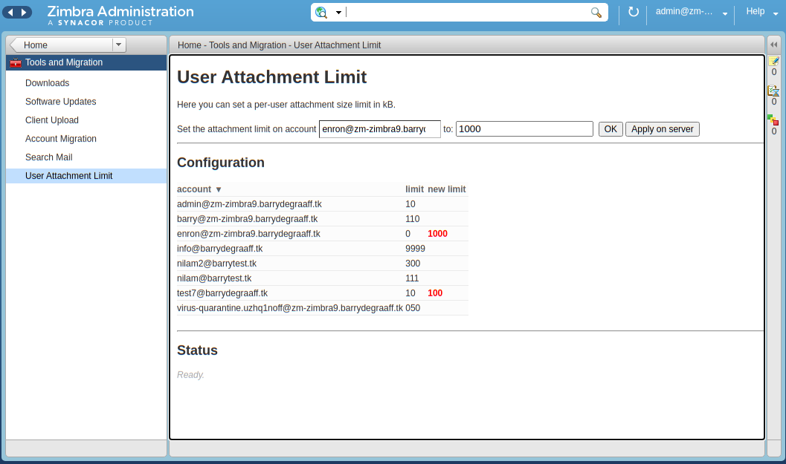

# Per user attachment size limits

With this Zimlet and extension you can configure per-user attachment limits. It works out of the box on a single server installation. On a multi-server setup you have to find a way to sync the config file to all your MTA servers. The Admin Zimlet and extension generate a Postfwd config file like this:

```
zimbra@zm-zimbra9:/root$ cat /opt/zimbra/conf/postfwd.cf
#do not make manual changes to this file, it is overwritten by perUserAttachmentLimit extension
id=SZ00000; protocol_state=END-OF-MESSAGE; size>=10240; sender==admin@zm-zimbra9.barrydegraaff.tk; action=REJECT HUGE FILE.
id=SZ00001; protocol_state=END-OF-MESSAGE; size>=10238976; sender==info@barrydegraaff.tk; action=REJECT HUGE FILE.
id=SZ00002; protocol_state=END-OF-MESSAGE; size>=113664; sender==nilam@barrytest.tk; action=REJECT HUGE FILE.
id=SZ00003; protocol_state=END-OF-MESSAGE; size>=9216000; sender==nilam2@barrytest.tk; action=REJECT HUGE FILE.
id=SZ99999; protocol_state=END-OF-MESSAGE; action=DUNNO
zimbra@zm-zimbra9:/root$ 
```

The Zimlet needs to be deployed with `zmzimletctl deploy com_zimbra_user_attachment_limit_admin.zip`.

The Extension needs to be placed like this:

```
zimbra@zm-zimbra9:/root$ ls -hal /opt/zimbra/lib/ext/perUserAttachmentLimit
total 20K
drwxr-xr-x  2 root   root   4.0K Jul  5 12:17 .
drwxrwxr-x 41 root   root   4.0K Jul  1 12:08 ..
-rw-r--r--  1 zimbra zimbra  729 Jul  5 12:18 config.json
-rw-r--r--  1 root   root   5.4K Jul  5 12:17 extension.jar
```

config.json can be an empty file, but Zimbra must have read/write permission to it.

Add a bash wrapper for reloading postfwd: 

```
cat  /usr/local/sbin/postfwd-reload
#!/bin/bash
/usr/sbin/postfwd2 --reload
```
# Postfwd

The general configuration for message sizes on the Zimbra MTA is to set a global parameter called zimbraMtaMaxMessageSize. This attribute is a global parameter and is the maximum total size of a mail message and is enforced by the mailbox server. The value is propagated to postconf's message_size_limit by zmmtaconfig. The default Zimbra MTA configuration uses the default Postfix message_size_limit of 10MB (i.e. '10240000' bytes). More information here - https://wiki.zimbra.com/wiki/Configuring_maxmessagesize

This section shows how Postfwd can be integrated with Postfix to allow per user settings to be configured. Postfwd is a postfix firewall daemon. Postfwd is written in Perl to combine complex postfix restrictions in a ruleset similar to those of most firewalls. The program uses the postfix policy delegation protocol to control access to the mail system before a message has been accepted. It allows you to choose an action (e.g. reject, dunno) for a combination of several SMTP parameters (like sender and recipient address, size or the client's TLS fingerprint).

## Installation

Popular Linux distributions like Debian and Ubuntu have postfwd 1.35 included in their package repository, so only thing you need to do is run ```apt-get install postfwd```.

Also, create a new file called ```postfwd-reload``` in ```/usr/local/sbin``` with the following content:
```
#!/bin/bash

/usr/sbin/postfwd --reload
```

## Setup
Postfwd listens on port 10040 and configuration file is located in /etc/postfix/postfwd.cf, but this can be overridden with postfwd arguments. 
Run postfwd manually in daemon mode with ruleset file /etc/postfix/postfwd.cf: 
```postfwd --daemon -v -f /etc/postfix/postfwd.cf -u zimbra -g zimbra```

Other switches -
```
Ruleset: (at least one, multiple use is allowed):
-f, --file <file>               reads rules from <file>
-r, --rule <rule>               adds <rule> to config-k, 
--kill, --stop                  terminate postfwd2
--reload, --hup                 reload postfwd2-I, 
--instantcfg                    reloads ruleset on every new request. This enables on-the-fly configuration changes without restarting.
-n, --nodns                     skip any dns based test
-t, --test                      testing, always returns "dunno"
-S, --summary <i>               show stats every <i> seconds
```
NOTE:
Postfwd has been installed as a standard deb package. The executable is /usr/sbin/postfwd and run as root user! 

## Policy or Ruleset File
  
A configuration line consists of optional item=value pairs, separated by semicolons (`;`) and the appropriate desired action:
```[ <item1>=<value>; <item2>=<value>; ... ] action=<result>```

Example:
```client_address=192.168.1.1 ; sender==no@bad.local ; action=REJECT```
This will deny all mail from 192.168.1.1 with envelope sender no@bad.local. The order of the elements is not important. Most values can be specified as regular expressions (PCRE).

Example: Configuration for different users to have different message size limits. 
```
id=SZ001; protocol_state=END-OF-MESSAGE; size>=10240; sasl_username==joe@zmail.lab; action=REJECT Message size $$size exceeds limit of 10KB.
id=SZ002; protocol_state=END-OF-MESSAGE; size>=10240000; sasl_username==jane@zmail.lab; action=REJECT Message size $$size exceeds limit of 10MB.
id=SZ003; protocol_state=END-OF-MESSAGE; size>=102400; sasl_username==tod@zmail.lab; action=REJECT Only 100K allowed. $$size not allowed.id=SZ100; protocol_state=END-OF-MESSAGE; action=DUNNO
```

A ruleset consists of one or multiple rules, which can be loaded from files or passed as command line arguments. 
Leading or trailing whitespace characters will be ignored. Use '#' to comment your configuration. A ruleset consists of one or multiple rules, which can be loaded from files or passed as command line arguments. 

Here is a breakdown of the above ruleset - \
```id=SZ001``` - an unique identifier for each ruleset \
```protocol_state``` - size of message will work reliably only at the END-OF-MESSAGE level \
```size >= 1024``` - message size (including headers) is greater than 1KB \
```sasl_username``` or ```sender``` - User defined for the limit \
```action=DUNNO``` - Action to be performed if the rule is TRUE \

The Postfix SMTP server has a number of built-in mechanisms to block or accept mail at specific SMTP protocol stages. Detailed information here - http://www.postfix.org/SMTPD_POLICY_README.html

## Enable postfwd with Zimbra
To enable postfwd, ```CBPolicy``` needs to be enabled - This is not mandatory but the current zmconfigd settings are written in this way and only one additional setting is required to enabled and use postfwd.

Add postfwd as a policy service to the postfix end of data restrictions - 
```
# cat /opt/zimbra/conf/zmconfigd/smtpd_end_of_data_restrictions.cf
check_policy_service inet:127.0.0.1:10040
check_policy_service inet:localhost:%%zimbraCBPolicydBindPort%%
```
Ensure that postfwd is running. You can manually start/stop postfwd using the following commands - \
Start - ```postfwd --daemon -v -f /opt/zimbra/conf/postfwd.cf -u zimbra -g zimbra -p 10040```  \
Stop - ```postfwd -k```

Note: Ensure that the port matches the end_of_data check policy settings

Check the services and restart the MTA:
```zmprov ms `zmhostname` +zimbraServiceEnabled cbpolicyd && zmmtactl restart```

NOTE: The maximum message size defined by ```zimbraMtaMaxMessageSize``` should be more than all the values in the ruleset. Example - Default size for all users is 50MB except for the ones defined in the ruleset.

## References

*	https://github.com/postfwd/postfwd
*	https://postfwd.org/doc.html
*	https://postfwd.org/quick.html


## Screenshots

> 
*Admin Zimlet for setting per user attachment limit.*
